# PlantUML Guide: Object & Sequence Diagrams

This guide covers the basics of creating Object and Sequence diagrams using PlantUML.

---

## Part 1: Object Diagrams

Object diagrams show *instances* of classes (objects) and their relationships at a specific point in time.

### 1. The Basics: Defining an Object
Every PlantUML diagram starts with `@startuml` and ends with `@enduml`. You define an object using the `object` keyword. 

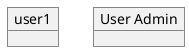
*Tip: If your object name has spaces, wrap it in quotes and give it an alias using `as` to make the rest of your code cleaner.*

### 2. Adding Attributes (State)
You can add state (attributes and values) using curly braces `{}` or using a colon `:`.

**Method 1: Curly braces (Best for multiple attributes)**
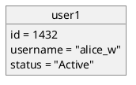

**Method 2: Colon mapping**
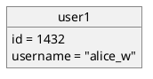

### 3. Adding Relationships (Links)
You connect objects using lines. Customize the lines to show different types of relationships:

* `--` (Solid line)
* `..` (Dashed line)
* `-->` (Directional arrow)
* `<--` (Directional arrow, other way)

Add labels by placing a colon `:` after the link:
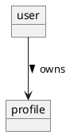

### 4. Complete Example (Hair Booking App)
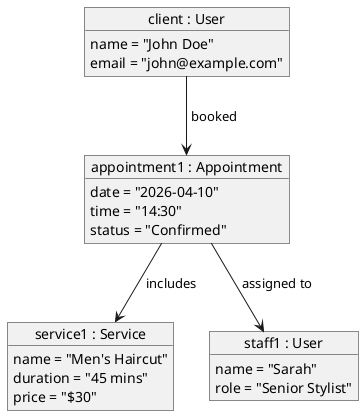

---

## Part 2: Sequence Diagrams

Sequence diagrams are fantastic for visualizing how different parts of a system interact over time.

### 1. The Basics: Participants and Messages
The most basic syntax is `ParticipantA -> ParticipantB : Message`. PlantUML automatically recognizes names and creates lifelines.

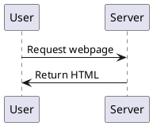

### 2. Defining Participant Types
You can declare participants explicitly to change their shapes:
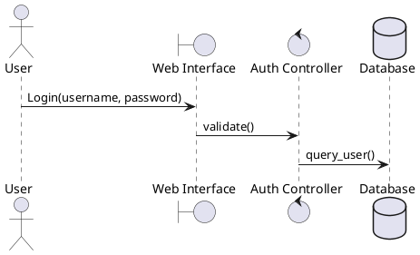
*Common types:* `actor`, `participant`, `database`, `control`, `boundary`, `queue`, and `collections`. 

### 3. Arrow Styles (Synchronous vs Asynchronous)
The type of arrow communicates the *type* of interaction:
* `->` (Solid line, solid arrow): **Synchronous request** (I ask and wait for a response)
* `-->` (Dotted line, solid arrow): **Return message/Response**
* `->>` (Solid line, open arrow): **Asynchronous request** (I send a message and keep working)

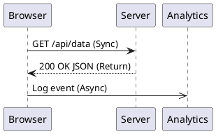

### 4. Activation and Deactivation (Lifelines)
Use `activate` and `deactivate` to show that a system is actively processing a task. (Or use `++` to activate and `--` to deactivate).

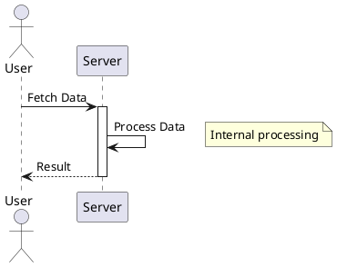

### 5. Logic Blocks (Loops, Alt, Opt)
Represent logic inside the diagram:
* **alt / else** (if/else logic)
* **loop** (for/while loops)
* **opt** (optional block)

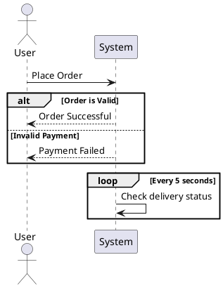

### 6. Complete Example (Booking an Appointment Sequence)

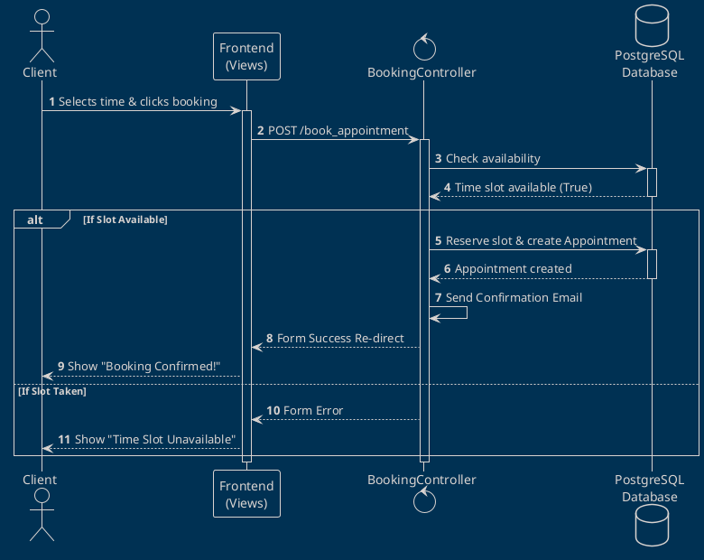
